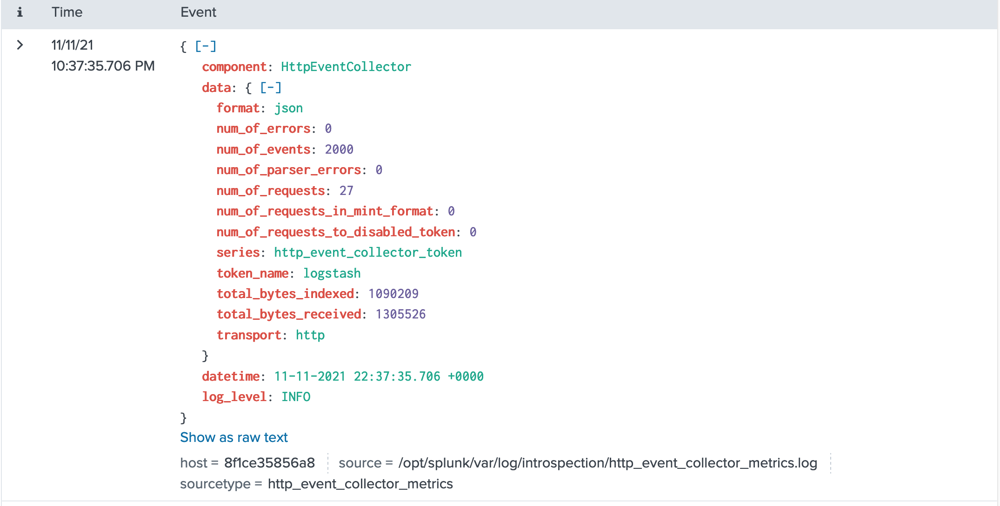
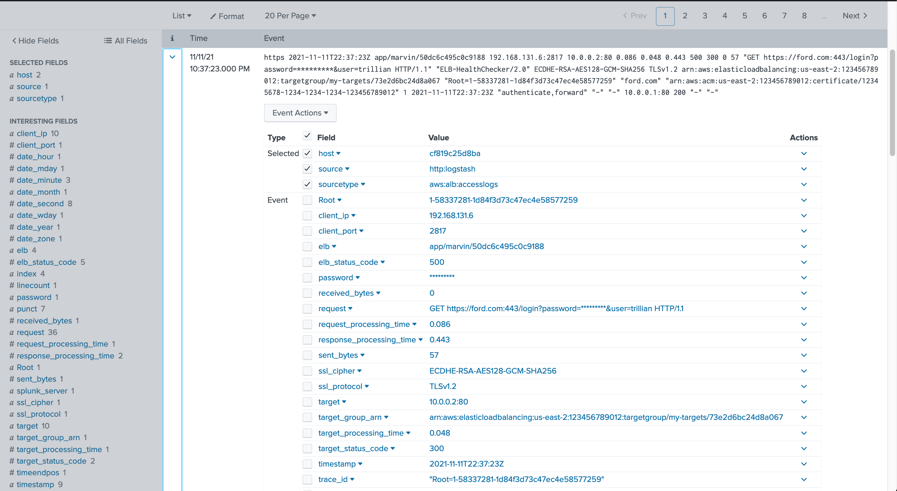

# Description

This sandbox generate random ALB logs and passes them through logstash. 

## Logstash

At launch time logstash:
* Installs the logstash-output-splunk plugin

### Logstach Config
* Masks any password included in the URI
* Drops ALB Healthchecks that returns a HTTP code of 200
* Clones the log for two different parsing paths
* Logstash uses the Splunk output plugin and batches logs

#### Splunk Filter Path
* Logstash adds a metadata field to identify this log is for splunk.
* It parses the ALB name to determine the index to send the log to. 
  * In this case it assumes that each ALB will go into an Index that matches the ALB's name
* Sets the Sourcetype to aws:alb:accesslogs
* Changes the message into HEC format and renames and remove fields.

#### Default Filter Path
* Logstash breaks out the message into JSON fieldsA

#### Output
* Logstash then uses the metadata field 'type' to determine if the log should be sent to splunk or stdout.

# Splunk
At launch time the splunk container:
* Setups the Indices and HEC tokens
* Create a sourcetype aws:alb:accesslogs 


# Usage

1. `docker compose up -d`
2. Log into Splunk UI on the host browser. `https://localhost:8000` 
* username = admin, password=adminadmin
3. Generate logs `cd logs && ./generate-https-logs.sh 2000`
4. Search in Splunk 

## Useful Splunk searches
* `index="_introspection" token "data.token_name"=logstash`
This will show metrics on HEC usage and can be used to help verify batching. In a test case of 2000 messages the num_of_events was 2000, and the num_of_requests was 27. Indicating batching.
* `index=* | stats count by index`
This will show the number of logs per index, indicating that logstash and Splunk are routing the logs to the correct index.


# Example





# Troubleshooting

`docker run -it --entrypoint bash --network logging docker.elastic.co/logstash/logstash-oss:7.15.0`

# Setup Notes

## Splunk Docker Configuration

Splunk provides a Docker container that can be used for testing and development. The container
runs ansible to initially configure the container. It is possible to adjust what Ansible
does by providing a Yaml file.

The command `docker run --rm -it splunk/splunk:8.2 create-defaults > config/splunk/defaults.yml`
can be run to generate the default Yaml file that ansible uses. The output can then be modified
and mounted in the container to be used by Ansible at Docker creation time.

For this Sandbox the configuration is modified to set HEC to use SSL false. This was done
to simplify testing. Logstash's HTTP output will not trust the self-signed cert. The
cert would need to be uploaded into a Keystore for Logstash to trust it, and the hostnames
would need to match. ( See notes below on the start of that for a future Sandbox )


## Logstash HTTP Output using SSL and Self Signed Certs

The Logstash HTTP Output does not support disabling SSL verification, and will fail when
talking to HEC if it uses a self-signed cert and the hostname used does not match the
SSL cert subject.

Below are the steps which can be used to import the Splunk HEC SSL cert so that Logstash
will trust the cert. This is currently a WIP.

1. Get the SSL cert and chain from Splunk. Note: This was done on the host running the Splunk container

```echo "" | openssl s_client -showcerts -connect localhost:8088 -prexit 2>/dev/null \
| sed -n -e '/BEGIN\ CERTIFICATE/,/END\ CERTIFICATE/ p' > /tmp/cert.pem```

2. Copy `/tmp/cert.pem` onto the running logstash container
3. Load the cert into the JDK Keystore Note: This is done on the logstash container.  `./jdk/bin/keytool -import -file /tmp/cert.pem -keystore jdk/lib/security/cacerts` Note: The default password is `changeit` and type `yes` when asked to trust the cert
4. TBD: The cert subject name does not currently match the container. Need to finish documenting that work and automate the above.

# References
* AWS ALB Logs - Documentation and example logs. https://docs.aws.amazon.com/elasticloadbalancing/latest/application/load-balancer-access-logs.html

# To Do
